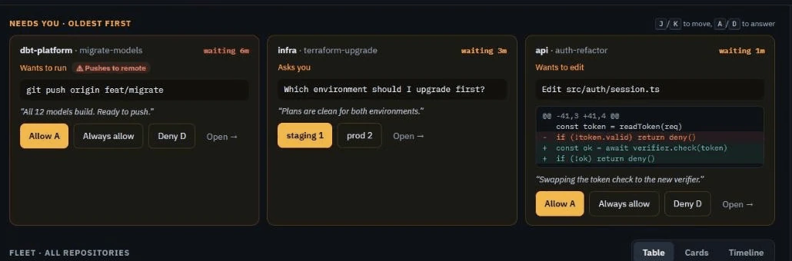

# Tower

A Claude Code plugin: one cockpit for every Claude Code agent on your machine, across all your repos. See who needs you, approve and answer, send prompts and slash commands, start agents in their own git worktrees, and watch what each one changes.

**[Try the live demo](https://alaturqua.github.io/tower-mods/demo/)** (in your browser, on sample data) · [Site](https://alaturqua.github.io/tower-mods/) · [Changelog](CHANGELOG.md)

<picture>
  <source media="(prefers-color-scheme: light)" srcset="site/images/approve-light.webp">
  
</picture>

## Install

```sh
claude plugin marketplace add alaturqua/tower-mods && claude plugin install tower@tower
```

Install it everywhere: every session then reports to the cockpit and can be steered from it. Sessions that were already running pick it up after a restart or `/reload-plugins`.

Then type **`/cockpit`** in any session. It starts the cockpit in the background and opens your browser.

Needs Node.js 18 or newer for the cockpit, and the GitHub CLI (`gh`) for pull requests. Mods draw nothing in the VS Code chat panel; for `/tower` and the status line, run Claude Code in a terminal (VS Code's integrated terminal works) or the desktop app's Code tab.

## The cockpit

| Area | What it does |
| --- | --- |
| **Needs you** | Permission requests and questions as cards, oldest first: the agent's reason, a diff for edits, a badge on risky commands (pushes, deletes, deploys). Allow, deny or answer with a click, or `A` / `D` / `1`–`4`. |
| **Fleet** | Every session as a table, cards or a timeline (your choice is remembered): state, what it's doing, lines changed, PR and CI, context fill, cost. Stuck, looping and context-full agents are flagged. |
| **Repositories and workstreams** | The left rail groups sessions by repo and git worktree. **+ New workstream** starts a background agent in a fresh worktree on its own branch (`claude --bg -w`). The ⋯ menus rename or remove repos and worktrees. |
| **The selected agent** | Its live activity, changed files, and pull request (squash-merge when it's green). Send it a prompt, or type `/` for its slash commands. Jump to its window, or stop it if it runs in the background. |

Select several agents to send them all the same prompt, or stop them. Everything follows System, Light or Dark.

### How it works and what it trusts

- **Local only.** The cockpit is a small Node server inside the plugin (`plugins/tower/cockpit`, no dependencies). It listens on `127.0.0.1` only. The link `/cockpit` opens carries a one-time token that the browser trades for a same-site cookie. The server refuses other host names and requests from other web pages.
- **What it reads:** `claude agents --json` for the live sessions, each session's status file in `~/.claude/tower/sessions/`, `git` in each working folder, and `gh` for pull requests.
- **How it steers:** prompts, slash commands and answers are appended to `~/.claude/tower/inbox/<session>.jsonl`. The plugin in that session picks them up within a second and runs them as if typed there. The cockpit shows "Queued" until it has. A session started before installing can't receive until it restarts, and the cockpit says so.
- **Answering from the cockpit:** a permission dialog belongs to its terminal. So by default only agents the cockpit launched send their permission prompts and questions to the cockpit. The agent is told to wait, your Allow arrives as its next prompt, and that exact call runs once. For a session you started by hand, the cockpit shows what it waits on and **Jump** brings its window forward. Set `remoteAnswers` to `always` to answer every session from the cockpit.
- **Launching agents:** Claude Code must have been trusted in a repository once (open Claude Code there and accept the prompt) before the cockpit can start agents in it.

## In the terminal

The same plugin works without the browser:

- **`/tower`** opens a pane beside your conversation with every session. Allow, deny, answer, send a prompt, jump, or launch a background agent. The same actions work as commands: `/tower list`, `/tower send <session> <prompt>`, `/tower launch <repo path> <task>`.
- **Notifications:** a desktop notification when a session needs you (Windows toast, macOS `osascript`, Linux `notify-send`).
- **Status line:** `1 needs you · tower-mods ⎇ main* · Opus 5.5 · high · auto · ctx 42% · $1.23`: other sessions waiting on you, then folder, branch (`*` when there are uncommitted changes), model, effort, permission mode, context fill and cost.

## Settings

Change these in `/config` or under `pluginConfigs.tower.options` in `~/.claude/settings.json`:

| Option | Default | Meaning |
| --- | --- | --- |
| `notifications` | `true` | Desktop notifications at all |
| `notifyOnDone` | `true` | Notify when a turn ends after `minTurnSeconds` |
| `minTurnSeconds` | `30` | Shorter turns end quietly |
| `notifyOnIdle` | `false` | Also notify on Claude Code's "still waiting" reminders |
| `remoteAnswers` | `launched` | Which sessions send permission prompts and questions to the cockpit and tower: `launched`, `always`, `never` |
| `inboxSeconds` | `1` | How often a session checks for prompts and answers from the cockpit; `0` turns it off |
| `pollSeconds` | `3` | How often `/tower` refreshes, once it has run in a session |
| `statusLine` | `true` | The status line at all |
| `showBranch`, `showContext`, `showCost` | `true` | Parts of the status line |
| `statusSeconds` | `5` | How often branch, context and cost are re-read between turns |

The status line learns the permission mode and effort when Claude Code reports them (each prompt, tool call and turn end), so a Shift+Tab switch shows with your next prompt.

## Developing

Add this working copy as a marketplace. Claude Code then reads the plugin straight from the folder:

```sh
claude plugin marketplace add D:\Projects\tower-mods
claude plugin install tower@tower
```

Edit, then `/reload-plugins` in a session, or start one with `claude --plugin-dir D:\Projects\tower-mods\plugins\tower` for hot reload. Run the cockpit from the folder with `node plugins/tower/cockpit/server.mjs --open`.

The plugin is one hooks module (`hooks/register.ts`) with three parts, each in its own file:

- `beacon.ts`: status file, notifications, inbox, remote answers;
- `pane.tsx`: `/tower` and `/cockpit`;
- `strip.ts`: the status line.

A part never passes `$` to another file; the engine refuses that.

The cockpit's page is built from the approved design: `cockpit/web/mockup.dc.html` plus `cockpit/web/logic.js`, through `node cockpit/web/build.mjs`. The build writes the cockpit's page and the site's live demo, which runs the same page against `site/demo/sample.js`.

```sh
claude plugin validate plugins/tower
claude plugin test plugins/tower
node --test plugins/tower/cockpit/test/model.test.mjs plugins/tower/cockpit/test/server.test.mjs plugins/tower/cockpit/test/actions.test.mjs
```

CI runs all of these on every push.

### Releasing

```sh
node scripts/release.mjs 0.3.0
git push --follow-tags
```

The script bumps the version in both manifests, regenerates `CHANGELOG.md` with [git-cliff](https://git-cliff.org), commits and tags. The pushed tag publishes a GitHub release with the notes for that version.

## License

Apache-2.0, see [LICENSE](LICENSE).
